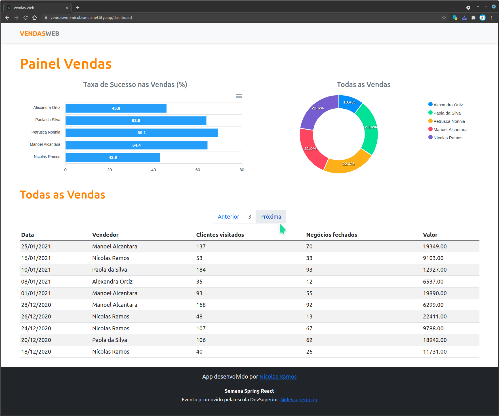

# VendasWeb


***```Programa GNU GPL```*** usando Java, TypeScript, ProgreSQL, H2, Spring Boot, React.  

```Visto o Heroku estar sendo usado na versão gratuita, é normal que ocorra uma demora de 1 ou 2 minutos na primerira vez que entra no ```***```Painel de Vendas```***

### Link App: &nbsp; [VendasWeb](https://vendasweb-nicolasmcp.netlify.app/) &nbsp;  &nbsp;  &nbsp; Link Código: &nbsp; [frontend](https://github.com/NicolasMCP/Spring-React-sds4/tree/main/frontend) &nbsp;  &nbsp;  &nbsp; Link Código: &nbsp; [backend](https://github.com/NicolasMCP/Spring-React-sds4/tree/main/backend)



<br/>

#### [infodata](https://nicolasmcp.github.io/infodata/)


#### [código infodata atualizando](https://github.com/NicolasMCP/infodata/blob/main/README.md)


#### [google drive](https://drive.google.com/drive/folders/0B8C7-DYa7vcUUVRzanFhZENMTFU)


#### [youtube](https://www.youtube.com/channel/UCYI7lWiyTmdY8vU6Ub1LZAw)


#### [anteriormente infodata.xyz](https://github.com/NicolasMCP/infodata.xyz/blob/master/README.md)


**Projeto de Nícolas Ramos**
<br/>
&nbsp;&nbsp;&nbsp;&nbsp;&nbsp;&nbsp;&nbsp;&nbsp;&nbsp;[nicolas.mcp@gmail.com](mailto:nicolas.mcp@gmail.com)
